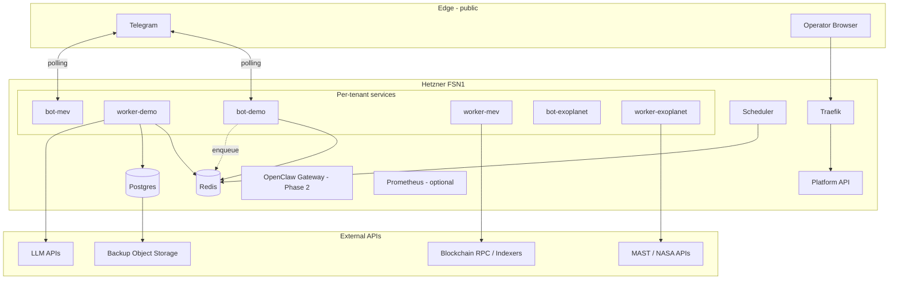

# Research Platform

Lightweight, multi-tenant **OpenClaw + Telegram** research stack for a single Hetzner dedicated server (Ryzen 7 3700X, 64 GB RAM, 2×1 TB NVMe, 1 Gbit, FSN1).

Supports:

- **MEV research** — pattern monitoring, tx tracking, Telegram digests
- **Blockchain anomaly detection** — wallet/fund-flow alerts
- **AI Collective** — publishing/coordination via Telegram
- **Exoplanet citizen science** — targeted TESS/Kepler analysis (cached, not full archives)

## Quick start

```bash
cp .env.example .env
# Edit DEMO_TELEGRAM_BOT_TOKEN and DEMO_TELEGRAM_ALLOWED_USER_IDS

make bootstrap
docker compose ps
curl http://127.0.0.1:8000/health/live
```

Telegram demo bot commands: `/start`, `/ping`, `/summarize <text>`

Optional monitoring:

```bash
make monitoring-up
```

### Exoplanet tenant

```bash
make exoplanet-setup
# Set EXOPLANET_TELEGRAM_* and optional MAST_API_TOKEN in .env
# Edit projects/exoplanet/config/targets.yaml

make exoplanet-up
curl http://127.0.0.1:8000/exoplanet/targets
```

Telegram: `/ingest` → `/scan` → `/summaries` → `/notify`

Review dashboard (set `PLATFORM_ADMIN_TOKEN` in `.env`):

```bash
open "http://127.0.0.1:8000/review/?token=YOUR_ADMIN_TOKEN"
# production: https://review.${PLATFORM_DOMAIN}/review/?token=...
```

Enable automatic LLM summaries on scheduled `/summaries` jobs:

```bash
EXOPLANET_LLM_SUMMARIES=true
OPENROUTER_API_KEY=sk-or-...
```

---

## 1. Architecture

### Design goals

- **One operator, one box** — Docker Compose, no Kubernetes
- **Soft multi-tenancy** — shared Postgres/Redis, hard per-tenant isolation at app layer
- **API-first AI** — external LLM APIs; no local GPU / large models
- **Small local data** — metadata + targeted caches only
- **Outbound-heavy workloads** — polling bots, RPC/MAST API calls, queue workers

### Logical view



### Service roles

| Component | Role |
|-----------|------|
| **Traefik** | TLS termination, route dashboards/API, rate limits |
| **Postgres** | Durable metadata, alerts, review state, job outcomes |
| **Redis** | RQ job queues, short-lived locks, rate-limit counters |
| **Platform API** | Health, tenant registry, exoplanet JSON API, review dashboard |
| **Bot services** | Telegram interface; auth gate; enqueue work |
| **Workers** | Pipelines, analysis, LLM summaries |
| **Scheduler** | Cron-style enqueue (APScheduler) |
| **OpenClaw Gateway** | Phase 2: agent runtime with tool policies per tenant |

### What runs on this box vs elsewhere

| On-box | Off-box |
|--------|---------|
| Bots, workers, scheduler, metadata DB | Full LLM inference |
| Traefik, Prometheus (lite) | Archive nodes / chain snapshots |
| Targeted exoplanet curve cache (≤80 GB) | Full TESS/Kepler mirrors |
| Small FastAPI dashboards | Heavy batch reprocessing |
| Postgres + Redis | Primary backup storage (S3-compatible) |

### OpenClaw placement

OpenClaw is the **agent runtime** (tools, memory, multi-channel routing). For this platform:

1. **Phase 1 (this scaffold)** — Python bots/workers handle Telegram + queues directly.
2. **Phase 2** — Add one shared `openclaw-gateway` container with **per-tenant agent workspaces** and strict tool allowlists; bots can delegate complex interactions to OpenClaw via internal HTTP.
3. **Do not** run one full OpenClaw gateway per tenant unless a tenant truly needs hard runtime isolation — it multiplies Node memory overhead.

---

## 2. Repository layout

```
research-platform/
├── docker-compose.yml          # Core stack + optional monitoring profile
├── .env.example                # Secret templates (never commit .env)
├── pyproject.toml              # Shared Python deps
├── Makefile
├── deploy/docker/
│   └── Dockerfile.platform     # Single image: api, bots, workers, scheduler
├── configs/
│   ├── traefik/                # Reverse proxy
│   ├── postgres/init/          # Per-tenant DB creation
│   └── prometheus/             # Scraping config
├── research_platform/           # Shared core
│   ├── core/                   # config, tenancy, logging, health
│   ├── api/                    # FastAPI (platform + exoplanet + review UI)
│   ├── templates/review/       # HTMX exoplanet review dashboard
│   ├── bots/                   # Telegram bot runners
│   ├── workers/                # RQ worker + shared jobs
│   └── scheduler/              # APScheduler cron enqueue
├── projects/                   # Tenant-specific code
│   ├── mev/
│   ├── anomaly/
│   ├── collective/
│   │   └── publish/            # Anonymous GitHub export/publish (API only)
│   └── exoplanet/
│       ├── config/targets.yaml # Curated TESS/Kepler targets
│       ├── pipelines/          # MAST ingest, analysis, LLM summaries
│       ├── review/             # Shared review query helpers
│       └── workers/
├── scripts/
│   ├── bootstrap.sh
│   ├── backup.sh
│   ├── setup-collective.sh
│   └── setup-exoplanet.sh
├── secrets/                    # gitignored; production secret mounts
└── data/                       # gitignored local volumes
```

---

## 3. Tenancy model

### Isolation layers

| Layer | Strategy |
|-------|----------|
| **Postgres** | One instance, **separate database per tenant** (`tenant_mev`, etc.) |
| **Redis** | One instance, **separate logical DB index** per tenant (0–4) |
| **Queues** | Separate RQ queue name per tenant |
| **Telegram** | **Separate bot token per tenant** (strongest practical boundary) |
| **Containers** | Separate bot + worker service per active tenant |
| **Filesystem** | Per-tenant cache subdirs; read-only code mounts |
| **AI tools** | Per-tenant allow/deny list in `projects/*/config.yaml` |

### Postgres: schemas vs databases

Use **separate databases**, not schemas:

- Simpler connection strings and backup/restore per tenant
- Clearer permission boundaries (`GRANT CONNECT ON DATABASE`)
- Easier future migration of one tenant off-box

Shared `platform_meta` DB holds cross-tenant ops tables (optional): deploy version, global config, audit log.

### Telegram bots

**One bot token per project.** Reasons:

- Independent allowlists and command sets
- Compromise of one bot doesn't expose others
- Clear operational ownership and rate-limit behavior
- OpenClaw multi-account routing maps cleanly to tenants

### Resource isolation

Docker Compose `deploy.resources.limits` on every service, plus:

- Worker concurrency caps per tenant (`WORKER_CONCURRENCY`)
- Redis `maxmemory 512mb` with LRU eviction
- Scheduler `max_instances=1, coalesce=True` to prevent pile-up
- Separate queues so one tenant's backlog doesn't block others

### Collective identity separation (anonymous GitHub)

The **AI Collective** tenant uses a dedicated anonymous GitHub account. This repo (`research-platform`) stays on your **personal** GitHub (`cspannos`); collective **content repos never live here**.

| Concern | Implementation |
|---------|----------------|
| Publish credentials | `secrets/collective/collective.env` (gitignored) — not root `.env` |
| Git commit identity | `COLLECTIVE_GIT_USER_NAME` + noreply email in collective.env |
| Automated publish | GitHub Contents API (`projects/collective/publish/github.py`) — no local `git push`, no shell |
| Default mode | **Export-only** (`COLLECTIVE_PUBLISH_ENABLED=false`) |
| Draft review | `/export` writes to `data/collective/exports/` on server |
| Backups | `tenant_collective` excluded from personal backups by default |

**Setup:**

```bash
make collective-setup          # creates secrets/collective/collective.env
# Edit collective.env with anon GitHub PAT + noreply email
# Set COLLECTIVE_TELEGRAM_* in root .env

make collective-up
```

**Telegram commands:** `/export slug | title | body` · `/publish slug | title | body` (only when publish enabled)

**Opsec checklist:**

- [ ] Anonymous GitHub account — no personal email on account
- [ ] Commit email = `id+user@users.noreply.github.com`
- [ ] Fine-grained PAT scoped to **one** anon repo only
- [ ] Never add anon repo as submodule or remote in this repo
- [ ] Keep `COLLECTIVE_PUBLISH_ENABLED=false` until you've reviewed export output
- [ ] Collective Telegram bot separate from personal/research bots
- [ ] Back up `tenant_collective` separately if needed (`EXCLUDE_COLLECTIVE_FROM_BACKUP=false`)

### GitHub account map

| Account | SSH host | Use for |
|---------|----------|---------|
| **cspannos** | `github-cspannos` | This repo (`research-platform`), personal infra |
| **titancassini** | `github-titancassini` | AI Collective content repos only — never push platform code here |

Use a dedicated account SSH key for `cspannos` pushes. Do not reuse deploy keys scoped to a single repo as your account key.

---

## 4. Security model

### Secret management

- Development: `.env` (gitignored)
- Production: `.env` with restrictive permissions **or** Docker secrets / `secrets/` bind mounts
- Never commit tokens, RPC URLs with keys, or LLM API keys
- Rotate Telegram bot tokens and LLM keys independently per tenant

### Telegram: polling vs webhook

**Recommendation: polling (default)** for research bots.

| Polling | Webhook |
|---------|---------|
| No public bot ingress | Requires HTTPS + stable URL |
| Works behind firewall/NAT | Slightly lower latency |
| Simpler ops for 1–4 bots | Needs Traefik route per bot if not multiplexed |

Use **webhooks only** for high-volume public bots or OpenClaw gateway integration later. Dashboards/APIs stay behind Traefik with TLS + auth.

### Firewall assumptions (Hetzner)

```
Inbound allow:
  22/tcp    SSH (key-only, fail2ban)
  80/tcp    HTTP → Traefik redirect
  443/tcp   HTTPS → Traefik

Deny everything else inbound.

Outbound allow:
  Telegram API, LLM APIs, RPC/indexers, MAST, DNS, NTP, backup S3
```

### Container hardening

- `security_opt: no-new-privileges:true`
- `read_only: true` on app containers + `tmpfs` for `/tmp`
- Non-root user in Dockerfile (`uid 10001`)
- Code/config mounts `:ro`
- No Docker socket in tenant containers
- Cap drop (add in production compose override)

### AI agent tool safety

Deny by default in tenant configs:

- `shell_exec`, arbitrary filesystem write, Docker control
- Private key export, wallet signing
- Unbounded HTTP (enforce domain allowlists in code)

Allow:

- Read-only RPC/indexer HTTP GET
- Postgres read/write **within tenant DB only**
- `redis_enqueue` to own queue
- Explicit `llm_summarize` wrapper with token/size caps

Run OpenClaw with **workspace jail** and per-agent skill allowlists when introduced in Phase 2.

### Backups

- Nightly `scripts/backup.sh`: per-database dumps + Redis RDB
- **`tenant_collective` excluded by default** (`EXCLUDE_COLLECTIVE_FROM_BACKUP=true`) so personal backup storage doesn't hold collective drafts
- Copy to off-box S3-compatible storage (Hetzner Storage Box / Backblaze / Wasabi)
- Retention: 14 days local, 90 days remote
- Test restore quarterly

---

## 5. Resource budget (64 GB / 8C / 2×1 TB)

### CPU (8 cores / 16 threads)

| Consumer | Limit | Notes |
|----------|-------|-------|
| OS + ssh + fail2ban | ~0.5c reserved | — |
| Traefik | 0.5c | — |
| Postgres | 1.5c | Tune `shared_buffers` ~2 GB |
| Redis | 0.5c | — |
| Platform API | 0.5c | — |
| Scheduler | 0.5c | — |
| Prometheus (opt) | 0.5c | 7d retention |
| **demo bot+worker** | 0.25 + 1.0c | Scaffold |
| **mev bot+worker** | 0.25 + 1.0c | concurrency 2 |
| **anomaly bot+worker** | 0.25 + 1.0c | concurrency 2 |
| **collective bot+worker** | 0.25 + 0.5c | light |
| **exoplanet bot+worker** | 0.25 + 1.0c | concurrency 1 |
| **Headroom** | ~1c | Spikes, deploys, manual ops |

**Not all tenants peak simultaneously** — design worker concurrency so ≤4 cores of heavy work at once.

### RAM

| Consumer | Limit |
|----------|-------|
| Postgres | 4 GB |
| Redis | 768 MB |
| Traefik + API + scheduler | ~1 GB |
| Each bot | 256 MB |
| MEV/anomaly worker | 1.5 GB × 2 max active ≈ 3 GB |
| Exoplanet worker | 2 GB |
| Collective worker | 768 MB |
| Monitoring | 1 GB |
| OS/cache headroom | ≥16 GB free |

Total planned ceiling ≈ **40–45 GB** under full load; leaves headroom for spikes.

### Disk (2×1 TB NVMe)

Recommended split:

| Mount | Size | Content |
|-------|------|---------|
| NVMe0 | 120 GB | OS, Docker images |
| NVMe0 | rest | `postgres_data` (LVM or separate partition) |
| NVMe1 | 80 GB | Exoplanet targeted cache |
| NVMe1 | 100 GB | Logs (rotated) + local backups |
| NVMe1 | remainder | Growth / second backup copy |

Use **mdadm RAID1** only if you accept write overhead; otherwise mirror via nightly off-box backup (preferred for this workload).

### Worker concurrency

| Tenant | Concurrency | Rationale |
|--------|-------------|-----------|
| demo | 1 | Smoke tests |
| mev | 2 | IO-bound RPC polling |
| anomaly | 2 | IO-bound + light transforms |
| collective | 1 | LLM-bound, low volume |
| exoplanet | 1 | CPU-bound numpy; no parallel heavy jobs |

### Offload elsewhere

- Full chain indexing / archive nodes
- Long GPU or large-scale ML
- Full astronomy archive mirrors
- Primary observability long-term storage (keep 7d local metrics)

---

## 6. Implementation plan

### Phase 0 — Server baseline hardening

- Ubuntu 24.04, unattended upgrades, key-only SSH, fail2ban
- UFW: 22/80/443 only
- Separate `deploy` user in `docker` group; no root deploys
- NVMe partitioning, swap **off** or small emergency swap
- DNS A records: `api.`, `traefik.`, future `review.`

### Phase 1 — Shared platform skeleton ✅ (this repo)

- Docker Compose: Traefik, Postgres, Redis, API, scheduler
- Tenant registry, health checks, structured JSON logging
- Demo bot + worker + 15-min scheduled heartbeat job

### Phase 2 — Telegram / OpenClaw core

- Add `openclaw-gateway` service with per-tenant workspaces
- Wire `summarize_text_job` to LLM API wrapper
- Pairing/allowlist enforcement matching OpenClaw `dmPolicy`
- Internal service auth between bot ↔ gateway ↔ workers

### Phase 3 — First blockchain tenant (MEV or anomaly)

- Enable `bot-mev` + `worker-mev` services in compose
- RPC client with caching; store flags in `tenant_mev`
- Daily Telegram digest pipeline
- Alert dedup + rate limits

### Phase 4 — Exoplanet tenant ✅ (initial)

- MAST metadata ingest for curated targets (`projects/exoplanet/config/targets.yaml`)
- Local `.npz` cache with 80 GB cap / 30-day retention
- Lomb-Scargle period search + candidate flagging in `tenant_exoplanet`
- Telegram bot (`/ingest`, `/scan`, `/analyze`, `/summaries`, `/notify`)
- Review API at `/exoplanet/candidates` (Traefik: `review.${DOMAIN}`)
- Scheduled ingest (02:00), scan (04:00), review digest (10:00 UTC)

### Phase 5 — Dashboard and review workflow ✅

- HTMX review UI at `/review/` (Traefik: `https://review.${DOMAIN}/review/`)
- Approve / reject / re-open candidates with reviewer comments
- LLM-enriched summaries via OpenRouter (`EXOPLANET_LLM_SUMMARIES=true` or per-candidate **Enrich** button)
- JSON API: comments + enrich endpoints under `/exoplanet/candidates/{id}/…`
- Auth: `PLATFORM_ADMIN_TOKEN` as `?token=` query param or `X-Admin-Token` header

---

## 7. Compose services (current)

| Service | Purpose |
|---------|---------|
| `traefik` | Reverse proxy, TLS, middlewares |
| `postgres` | Metadata DB + per-tenant DBs |
| `redis` | Queues and ephemeral state |
| `platform-api` | Health, `/tenants`, `/metrics`, `/exoplanet/*`, `/review/*` |
| `bot-demo` | Working Telegram stub (polling) |
| `worker-demo` | RQ worker for demo queue |
| `scheduler` | Enqueues heartbeat every 15 min |
| `bot-collective` / `worker-collective` | Optional `--profile collective` |
| `bot-exoplanet` / `worker-exoplanet` | Optional `--profile exoplanet` |
| `prometheus` (+ exporters) | Optional `--profile monitoring` |

Copy `docker-compose.yml` blocks to add `bot-mev`, `worker-mev`, etc. when enabling tenants.

---

## 8. Development

```bash
python -m venv .venv && source .venv/bin/activate
pip install -e ".[dev]"
pytest
ruff check .
```

---

## License

Private / operator-owned. Add a license if you open-source components.
